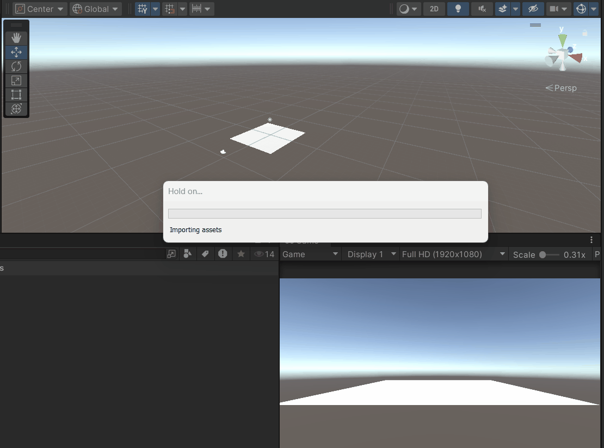
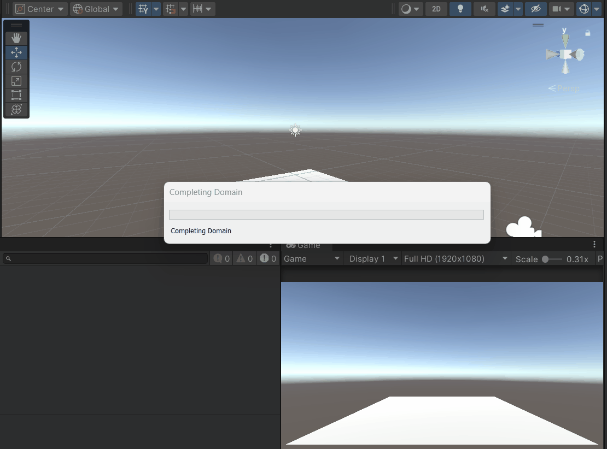
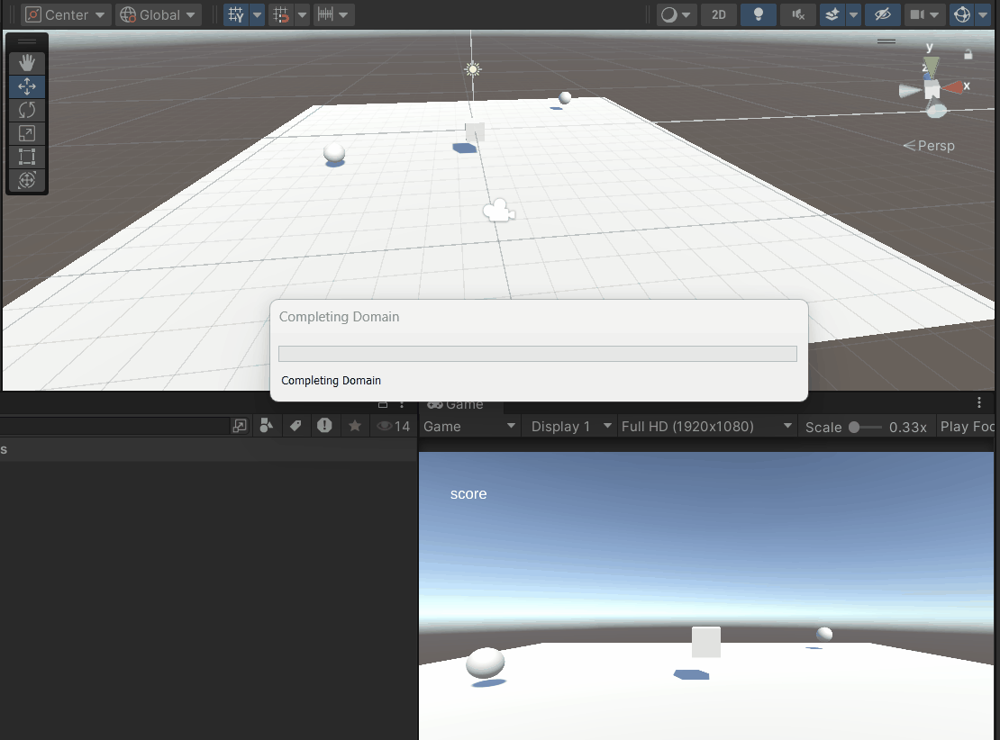
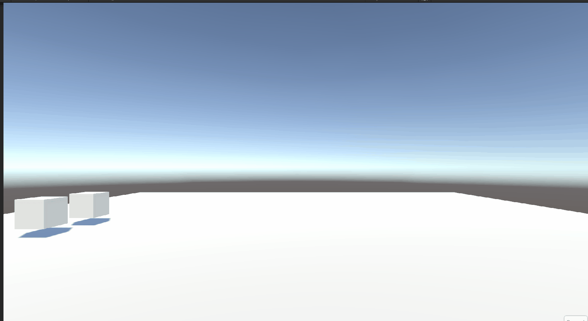

# M5PROG

## Opdracht 1 Functions, Methods, Parameters & return type

[code](Assets/Scripts/M5/opdr1.cs)

## Opdracht 2 Class, Object, Constructor & Instantiate
Door gebruik van Instatiate maak ik een toren die wanneer je klikt geinstantiate word op een random plaats en met een random grote. 

[code](Assets/Scripts/M5/opdr2.cs)

## Opdracht 3 Array, List & Loops
Met gebruik van een List zorg ik ervoor dat als je W drukt er 100 Enemies geinstantiate worden, als je Q drukt worden ze allemaal weer verwijderd en wordt de lijst ook leeg gemaakt.

[code](Assets/Scripts/M5/opdr3Enemy.cs)
[code](Assets/Scripts/M5/opdr3EnemySpawner.cs)

## Opdracht 4 Action Events
Als de pickup word aangeraakt stuurt hij een invoke aan die het script van het scoreboard pakt en inzet waardoor de score met 50 omhoog gaat, daarnaast heb ik wat simpele code gebruikt voor de beweging van de speler en de camera.

[code](Assets/Scripts/M5/opdr4Pickup.cs)
[code](Assets/Scripts/M5/opdr4Scoreboard.cs)

## Opdracht 5 Inheritance
De twee kubisen gebruiken dezelfde class maar hebben hun eigen script om de functies in de parent class anders uit te voeren

[code](Assets/Scripts/M5/opdr5/EnemyParent.cs)
[code](Assets/Scripts/M5/opdr5/Brute.cs)
[code](Assets/Scripts/M5/opdr5/Elf.cs)

## Opdracht 6 Encapsulation
Ik heb het Projectile script aangepast zodat de 'Transform target' private is maar dat het wel gelezen en verandert mag worden.
Het Path script mag alleen gelezen worden want het pad heeft waardes die niet verandert mogen worden

[code](https://github.com/MA-CSALT/M5-TOWER-DEFENSE/blob/main/Assets/Scripts/Path.cs)
[code](https://github.com/MA-CSALT/M5-TOWER-DEFENSE/blob/main/Assets/Scripts/Projectile.cs)

## Opdracht 7 Class Diagram van je TD project
Zo goed mogelijk geprobeert de depenencies tussen de classes en hun funties en variabelen te laten zien
[TD-code](https://github.com/MA-CSALT/M5-TOWER-DEFENSE/tree/main/Assets/Scripts)
[ClassDiagram](readmeAssets/classdiagram.md)

# M6PROG

## Opracht 7 Early Returns
[code](Assets/Scripts/M6/opdr7.cs)