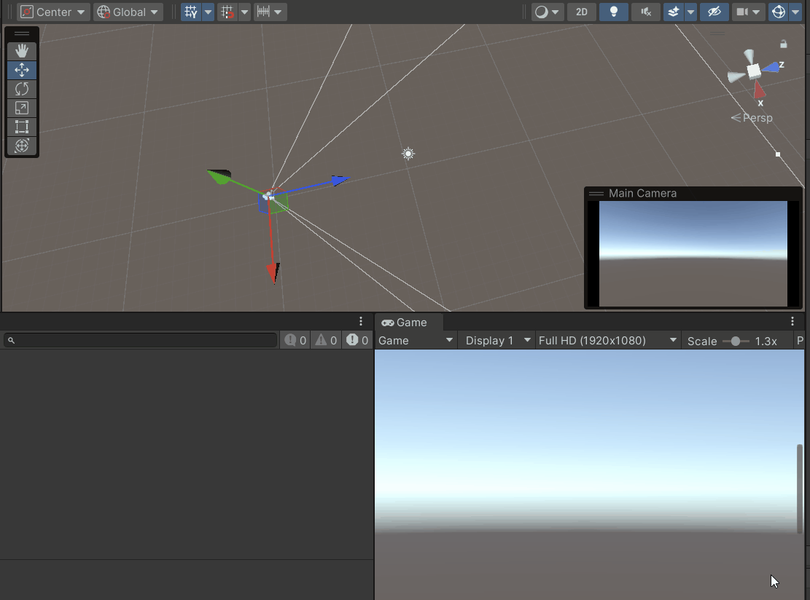
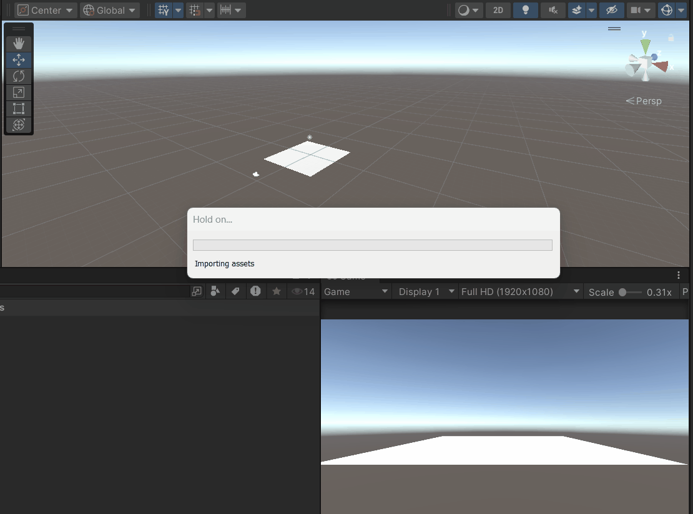

# M5PROG

## Opdracht 1.1 Functions, Methods, Parameters & return type

[code](Assets/Scripts/opdr1.1.cs)

## Opdracht 1.2 Class, Object, Constructor & Instantiate

[code](Assets/Scripts/opdr1.2.cs)