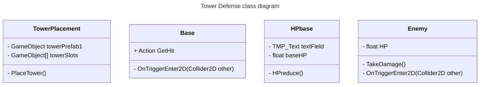

```mermaid

---
title: Tower Defense class diagram
---

classDiagram

class TowerPlacement{
    - GameObject towerPrefab1
    - GameObject[] towerSlots
    - PlaceTower()
}

class Base{
+ Action GetHit
- OnTriggerEnter2D(Collider2D other)
}

class HPbase{
- TMP_Text textField
- float baseHP
- HPreduce()
}

class Enemy{
- float HP
- TakeDamage()
- OnTriggerEnter2D(Collider2D other)
}

```