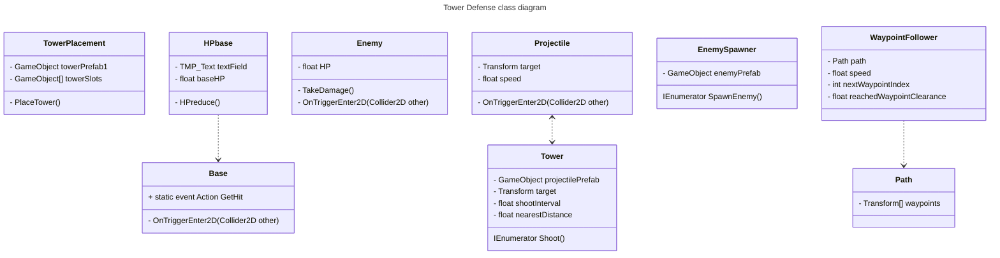

```mermaid

---
title: Tower Defense class diagram
---

classDiagram

class TowerPlacement{
    - GameObject towerPrefab1
    - GameObject[] towerSlots
    - PlaceTower()
}

class Base{
+ static event Action GetHit
- OnTriggerEnter2D(Collider2D other)
}

class HPbase{
- TMP_Text textField
- float baseHP
- HPreduce()
}

class Enemy{
- float HP
- TakeDamage()
- OnTriggerEnter2D(Collider2D other)
}

class Projectile{
- Transform target
- float speed
- OnTriggerEnter2D(Collider2D other)
}

class Tower{
- GameObject projectilePrefab
- Transform target
- float shootInterval
- float nearestDistance
IEnumerator Shoot()
}

class Path{
- Transform[] waypoints
}

class EnemySpawner{
- GameObject enemyPrefab
 IEnumerator SpawnEnemy()
}

class WaypointFollower{
-  Path path
- float speed
- int nextWaypointIndex
- float reachedWaypointClearance
}

HPbase ..>  Base

Projectile <..> Tower

WaypointFollower ..> Path

```